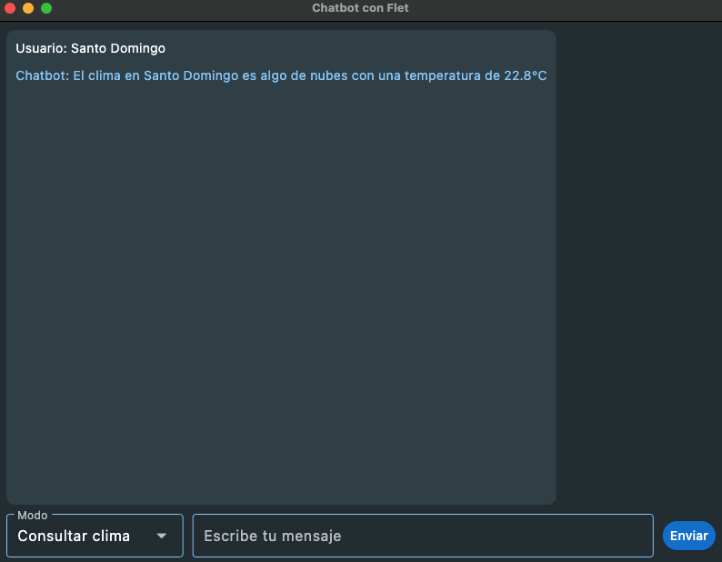

# Chatbot IA con Consulta del Clima

Un chatbot inteligente con interfaz gráfica que permite realizar consultas a un modelo de IA (Mistral 7B) y obtener información del clima en tiempo real para cualquier ciudad.

## Capturas de pantalla

<div align="center">
  
  
</div>

## Características

- **Interfaz gráfica moderna** construida con Flet
- **Modo de chat con IA** usando Mistral 7B a través de OpenRouter
- **Consulta del clima en tiempo real** usando OpenWeatherMap API
- **Interfaz de usuario intuitiva** con modo oscuro
- **Diseño responsivo** que se adapta a diferentes tamaños de pantalla

## Demostración

### Modo Chat con IA
El chatbot puede responder a una amplia variedad de preguntas:
- Información general
- Ayuda con tareas
- Respuestas conversacionales

### Modo Clima
Simplemente ingresa el nombre de cualquier ciudad para obtener:
- Temperatura actual
- Descripción del clima
- Información en español

## Instalación

```bash
# Clonar el repositorio
git clone https://github.com/TU_USUARIO/chatbot-ia-clima.git

# Entrar al directorio
cd chatbot-ia-clima

# Instalar dependencias
pip install -r requirements.txt

# Configurar variables de entorno
# Copia .env.example a .env y agrega tus claves API
cp .env.example .env

# Ejecutar la aplicación
python app_2.py
```

## Requisitos

Para usar este chatbot necesitarás:
1. Una clave API de [OpenRouter](https://openrouter.ai/) para acceder a modelos de IA
2. Una clave API de [OpenWeatherMap](https://openweathermap.org/api) para las consultas del clima

## Tecnologías utilizadas

- **Python** - Lenguaje de programación principal
- **Flet** - Framework para crear interfaces gráficas modernas
- **OpenAI API** - Cliente para conectar con OpenRouter
- **Requests** - Para realizar consultas HTTP a la API del clima
- **python-dotenv** - Para gestionar variables de entorno

## Estructura del proyecto

```
chatbot-ia-clima/
├── app_2.py           # Archivo principal de la aplicación
├── .env.example       # Ejemplo de configuración de variables de entorno
├── requirements.txt   # Dependencias del proyecto
├── images/            # Capturas de pantalla e imágenes para documentación
│   ├── chat-mode.png  # Captura del modo chat con IA
│   └── weather-mode.png  # Captura del modo consulta del clima
└── README.md          # Este archivo
```

## Contribuciones

Las contribuciones son bienvenidas. Si deseas mejorar este proyecto:

1. Haz un fork del repositorio
2. Crea una rama para tu característica (`git checkout -b feature/nueva-caracteristica`)
3. Haz commit de tus cambios (`git commit -m 'Añadir nueva característica'`)
4. Haz push a la rama (`git push origin feature/nueva-caracteristica`)
5. Abre un Pull Request

## Licencia

Este proyecto está licenciado bajo la Licencia MIT - ver el archivo [LICENSE](LICENSE) para más detalles.

## Contacto

[Tu Nombre](mailto:tu_email@ejemplo.com)

---

Desarrollado con ❤️ por [Tu Nombre]
